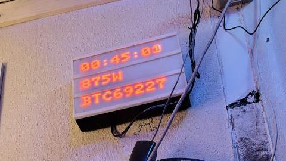

LED lightbox
------------

It looks like:

See https://komputilo.nl/texts/lightbox/ for more details.

64x24 display

* listens on port 1337 for Pixelflood
* listens on port 226.1.1.9:32009 for multicast LZJB encoded frames
* listens on 4048 (UDP) for DDP: only RGB or grayscale (8 bit per component)

* arduino/ contains the "firmware" for the ESP8266
* python/ contains some example Python scripts to interact with it altough Pixelflood and DDP will work just fine

Written by Folkert van Heusden
